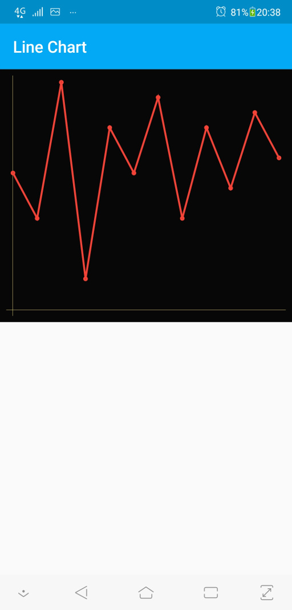
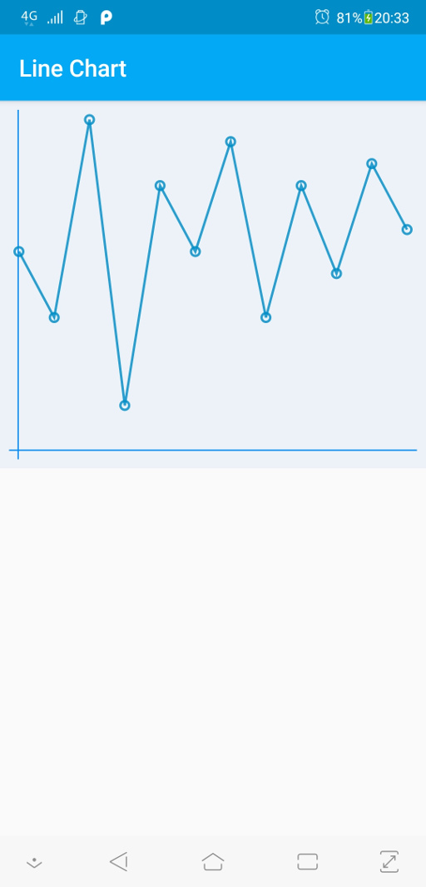

# LineChart

Simple library for android Line Chart view

### Download

Download via Gradle:

```gradle
implementation 'com.github.VladlinMoiseenko:linechart:0.0.1'
```

### Usage

Add LineChart view to activity layout:
```xml
    <ru.vladlin.linechart.LineChart
        android:id="@+id/linechart"
        android:layout_width="match_parent"
        android:layout_height="0dp"
        android:layout_weight="1"
        android:padding="16dp"
        android:background="#ECF2F8"
        attrs:lc_lineСolor="#D5008DC7"
        attrs:lc_lineWidth="6"
        attrs:lc_cursorColor="#D5018BF8"
        attrs:lc_cursorWidth="4"
        attrs:lc_circleRadius="11"
        />
```

In activity class:
```java
    LineChart lineChart = (LineChart) findViewById(R.id.linechart);
    lineChart.setDataChart(new float[] { 9, 6, 15, 2, 12, 9, 14, 6, 12, 8, 13, 10 });
```

### Screenshots


